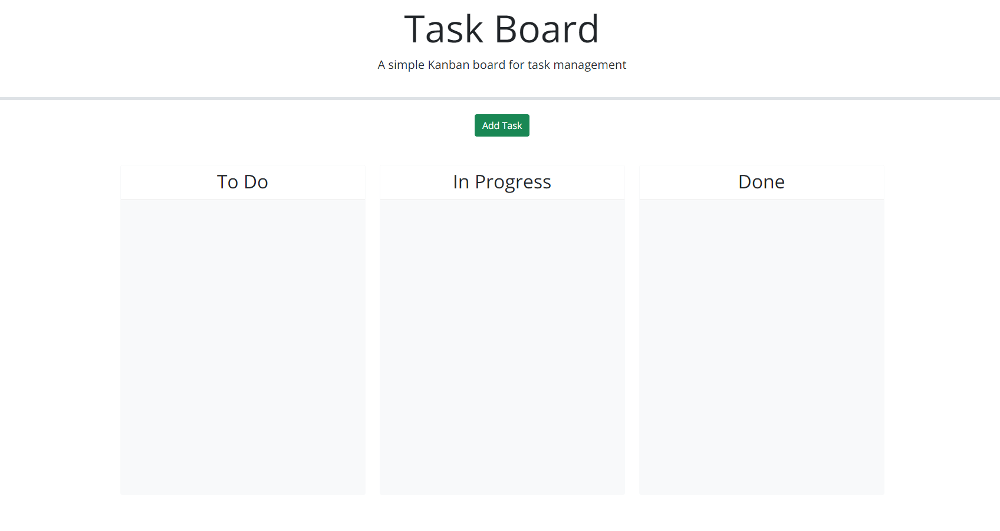

# Get It Done Task List

## DESCRIPTION

This is a simple task list to help you stay on track. It will stay around even if you close your browser and come back. 

## INSTALLATION

Nothing to install. Just go to the site: <a href="https://aaronseth-a.github.io/will-finish-eventually-list/">https://aaronseth-a.github.io/will-finish-eventually-list/</a> 

## USAGE


Click the button at the top to make a task. Give it a title, description and pick the due date. Move it from column to column to show what state it's in. When there's only 4 days until the deadline it will turn yellow, and once the deadline has arrived it will turn red. When the task is complete or you just don't need the reminder anymore click 'Delete'.

## CHALLENGE REQUIREMENTS

### User Story

```md
AS A project team member with multiple tasks to organize
I WANT a task board 
SO THAT I can add individual project tasks, manage their state of progress and track overall project progress accordingly
```

### Acceptance Criteria

```md
GIVEN a task board to manage a project
WHEN I open the task board
THEN the list of project tasks is displayed in columns representing the task progress state (Not Yet Started, In Progress, Completed)
WHEN I view the task board for the project
THEN each task is color coded to indicate whether it is nearing the deadline (yellow) or is overdue (red)
WHEN I click on the button to define a new task
THEN I can enter the title, description and deadline date for the new task into a modal dialog
WHEN I click the save button for that task
THEN the properties for that task are saved in localStorage
WHEN I drag a task to a different progress column
THEN the task's progress state is updated accordingly and will stay in the new column after refreshing
WHEN I click the delete button for a task
THEN the task is removed from the task board and will not be added back after refreshing
WHEN I refresh the page
THEN the saved tasks persist
```

## CONTACT INFORMATION
<strong>Name:</strong> Aaron Allen  
<strong>Email:</strong> aaronseth.allen@gmail.com 
